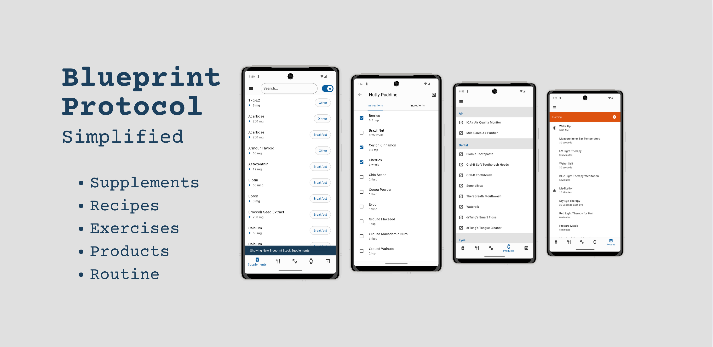

> [!TIP]
> Search for the "Blueprint Protocol" app on the app stores for all of this in your pocket!

# Table of Contents

[🔵 The Blueprint Protocol](#protocol)

[💊 Supplements](#supplements)

[🥗 Recipes](#recipes)

[🫀 Exercise](#exercise)

[⌚ Products](#products)

[🗓️ Routine](#routine)

# 🔵 The Blueprint Protocol

## About Blueprint

Blueprint is a data-driven health optimization protocol developed by Bryan Johnson and his team. After decades of entrepreneurship (including selling Braintree/Venmo for $800M) and experiencing chronic health issues, Johnson developed a system that helped him achieve some of the world's best comprehensive biomarkers.

## Core Principles

### 1. Eliminate Self-Destructive Behavior
- Identify and address destructive patterns
- Create clear boundaries for decision-making
- Implement systematic controls over impulsive choices

### 2. Let Your Body Lead
- Use hundreds of biological measurements to make decisions
- Follow evidence-based scientific protocols
- Prioritize organ health over mental cravings

### 3. Expand Your Health Horizons
- Embrace technological and scientific progress
- Take incremental steps toward optimal health
- Build sustainable, measurable improvements

### 4. Focus on Data-Driven Results
- Use STEM principles for health decisions
- Measure and optimize biological processes
- Automate health decisions where possible

## Vision
Blueprint represents a shift from traditional health paradigms to a data-driven approach for optimal longevity. The protocol aims to answer the question: "Are we the first generation that won't die?" It combines cutting-edge science, technology, and systematic measurement to optimize human health.

> [!IMPORTANT]
> This protocol was developed through extensive research and personal experimentation. Always consult with healthcare professionals before making significant changes to your health routine.

---

*"May we have the courage and wisdom to believe that now is the very beginning." - Bryan Johnson*

# 💊 Supplements

The following table details the supplement protocol. Always consult with healthcare professionals before starting any supplement regimen.

| Supplement | Amount | Timing | Form | Notes |
|------------|---------|---------|------|-------|
| Collagen Peptides | 12.5g | Breakfast | Powder | |
| GOS | 0.5 tsp | Breakfast | Powder | |
| Inulin | 1 tsp | Breakfast | Powder | |
| Vitamin C | 250 mg | Breakfast | Powder | As Ascorbic Acid |
| Calcium | 400 mg | Breakfast | Powder | As CaAKG |
| Magnesium | 150 mg | Breakfast | Powder | As Magnesium Citrate |
| Calcium Alpha-Keto Glutarate (CaAKG) | 2000 mg | Breakfast | Powder | |
| Taurine | 1500 mg | Breakfast | Powder | |
| Glycine | 1200 mg | Breakfast | Powder | |
| L-Lysine | 1000 mg | Breakfast | Powder | As HCl |
| Glucosamine Sulfate | 750 mg | Breakfast | Powder | As KCl |
| L-Glutathione Reduced | 250 mg | Breakfast | Powder | |
| L-Theanine | 200 mg | Breakfast | Powder | |
| Sodium Hyaluronate | 120 mg | Breakfast | Powder | |
| Acarbose | 200 mg | Breakfast | | |
| Vitamin D | 50 mcg | Breakfast | Pill | As Cholecalciferol |
| Vitamin E | 67 mg | Breakfast | Pill | As alpha-Tocopherol |
| Thiamin | 1.1 mg | Breakfast | Pill | As HCl |
| Riboflavin | 1.3 mg | Breakfast | Pill | As Vitamin B2 |
| Niacin | 15 mg | Breakfast | Pill | As Niacinamide |
| Vitamin B6 | 1.4 mg | Breakfast | Pill | As Pyridoxine HCl |
| Folate | 200 mcg DFE | Breakfast | Pill | As Calcium L-5 Methyltetrahydrofolate |
| Vitamin B12 | 125 mcg | Breakfast | Pill | As Methylcobalamin |
| Biotin | 50 mcg | Breakfast | Pill | |
| Pantothenic Acid | 6 mg | Breakfast | Pill | As D-Calcium Pantothenate |
| Calcium | 50 mg | Breakfast | Pill | As Carbonate and Dicalcium Phosphate |
| Iodine | 200 mcg | Breakfast | Pill | As Potassium Iodide |
| Zinc | 15 mg | Breakfast | Pill | As Bisglycinate |
| Selenium | 28 mcg | Breakfast | Pill | As L-Selenomethionine |
| Manganese | 1 mg | Breakfast | Pill | As Citrate |
| Nicotinamide Riboside | 300 mg | Breakfast | Pill | As Chloride |
| Broccoli Seed Extract | 200 mg | Breakfast | Pill | Contains Glucoraphanin 20 mg |
| Fisetin | 100 mg | Breakfast | Pill | From Stem of Smoketree Extract |
| Luteolin | 100 mg | Breakfast | Pill | From Bud of S.japonica Extract |
| Ubiquinol | 50 mg | Breakfast | Pill | As Reduced CoQ10 |
| Lactobacillus acidophilus | 20 mg | Breakfast | Pill | 4 Billion CFU |
| Spermidine | 10 mg | Breakfast | Pill | As Trihydrochloride |
| Boron | 3 mg | Breakfast | Pill | As Glycinate |
| Lithium | 1 mg | Breakfast | Pill | As Orotate |
| Vitamin K1 | 1500 mcg | Breakfast | Pill | As Phytonadione |
| Lutein | 15 mg | Breakfast | Pill | From Marigold Flower Extract |
| Lycopene | 15 mg | Breakfast | Pill | |
| Astaxanthin | 12 mg | Breakfast | Pill | From Haematococcus pluvialis Microalgae |
| Vitamin K2 MK4 | 5 mg | Breakfast | Pill | As Menaquinone-4 |
| Zeaxanthin | 3 mg | Breakfast | Pill | From Marigold Flower Extract |
| Vitamin K2 MK7 | 600 mcg | Breakfast | Pill | As Menaquinone-7 |
| N-Acetyl-Cysteine | 1200 mg | Breakfast | Pill | |
| Ginger Extract | 400 mg | Breakfast | Pill | From Zingiber officinale Roscoe (26% Gingeroids) |
| Curcumin Extract | 250 mg | Breakfast | Pill | From Curcuma longa (85% Curcuminoids) |
| Red Yeast Rice Extract | 500 mg | Breakfast | Pill | |
| Odorless Garlic Extract | 100 mg | Breakfast | Pill | From Allium sativum (12:1 Extract from bulb) |
| EPA/DHA/DPA | 800 mg | Breakfast | Pill | |
| Garlic | 1.2 g | Breakfast | Pill | As kyolic |
| Metformin ER | 1500 mg | Breakfast | Pill | Prescription medication |
| NR | 450 mg | Breakfast | Pill | |
| NMN | 500 mg | Breakfast | Pill | |
| ProButyrate | 600 mg | Breakfast | Pill | |
| Proferrin | 10.5 mg | Breakfast | Pill | |
| Plasmalogens | 1 mL | Breakfast | Liquid | |
| Creatine | 2.5 g | Breakfast | Powder | |
| EPA/DHA/DPA | 800 mg | Dinner | Pill | |
| Garlic | 1.2 g | Dinner | Pill | |
| NAC | 1800 mg | Dinner | Pill | |
| Melatonin | 300 mcg | Pre-sleep | | |
| Extra Virgin Olive Oil | 15 mL | Per meal | Liquid | |
| High Polyphenol Cocoa | 6 g | Other | Powder | |
| Pea/Hemp Protein | 29 g | Other | Powder | |
| Rapamycin | 6/13 mg | Other | Pill | Prescription - alternating doses biweekly |
| 17α-E2 | 8 mg | Other | Liquid | Transdermal weekly |
| Levothyroxine | 112 mcg | Other | Pill | Prescription medication |
| Armour Thyroid | 60 mg | Other | Pill | Prescription medication |

> [!IMPORTANT]
> Many of these supplements are prescription medications or may interact with other medications. Always consult with healthcare professionals before starting any supplement regimen.

# 🥗 Recipes

> [!NOTE]
> Check out the free [Recipe Guide by Zero](https://protocol.bryanjohnson.com/Recipe-Guide-by-Zero)

| Recipe | Calories | Total Fat (g) | Saturated Fat (g) | Sodium (mg) | Total Carbs (g) | Dietary Fiber (g) | Sugars (g) | Protein (g) |
|--------|----------|--------------|-------------------|-------------|----------------|------------------|------------|------------|
| [Beet Poke](https://www.nutritionvalue.org/public_recipe_220262.html) | 504 | 29 | 4.2 | 354 | 60 | 17 | 36 | 9.9 |
| [Blood Orange + Fennel Salad](https://www.nutritionvalue.org/public_recipe_220204.html) | 621 | 33 | 4 | 341 | 70 | 19 | 29 | 18 |
| [Buddha Bowl](https://www.nutritionvalue.org/public_recipe_220215.html) | 465 | 34 | 3.5 | 226 | 32 | 9.7 | 2.2 | 16 |
| [Chickpea Curry Over Greens](https://www.nutritionvalue.org/public_recipe_220261.html) | 630 | 22 | 3 | 257 | 93 | 23 | 29 | 21 |
| [Collard Green Wraps + Red Pepper Dip](https://www.nutritionvalue.org/public_recipe_220307.html)| 614 | 57 | 8.8 | 41 | 28 | 16 | 8.3 | 11 |
| [Nutty Pudding](https://protocol.bryanjohnson.com/#step-1-meal-prep) | 432.6 | 32.2 | 4.6 | 81.2 | 34.1 | 18.9 | 10.8 | 8.5 |
| [Roasted Beets + Green Lentils + Wilted Chard](https://www.nutritionvalue.org/public_recipe_220246.html) | 468 | 28 | 3.2 | 666 | 51 | 16 | 25 | 16 |
| [Roasted Bok Choy + Japanese Sweet Potato](https://www.nutritionvalue.org/public_recipe_220305.html) | 447 | 30 | 3.8 | 344 | 41 | 11 | 12 | 12 |
| [Roasted Cabbage Steaks + Sweet Potato Mash](https://www.nutritionvalue.org/public_recipe_220247.html) | 578 | 41 | 5.9 | 117 | 47 | 13 | 14 | 17 |
| [Roasted Veggie Lettuce Wraps](https://www.nutritionvalue.org/public_recipe_220241.html) | 500 | 15 | 2.6 | 271 | 89 | 25 | 39 | 14 |
| [Super Veggie](https://protocol.bryanjohnson.com/#step-1-meal-prep) | 378 | 7 | 0.8 | 170.8 | 64 | 27.3 | 7.8 | 25.5 |
| [Sweet Potato + Mushroom Toast](https://www.nutritionvalue.org/public_recipe_220259.html) | 450 | 29 | 4.1 | 365 | 48 | 12 | 11 | 7.6 |

> [!NOTE]
> Nutrition values were calculated using [nutritionvalue.org's Nutrition Calculator](https://www.nutritionvalue.org/)

# 🫀 Exercise

## Daily Routine
| Exercise | Sets x Reps | Group |
|----------|------------|--------|
| Backwards Sled | 2 min | Legs |
| Posture exercises | 1 set | All |
| Tricep extensions | 1 x 25 | Arms |
| Face pulls | 1 x 15 | Back |
| Butterfly | 1 x 15 | Chest |
| Band pull apart | 1 x 15 | Back |
| Back extensions | 1 x 25 | Back |
| Obliques | 1 x 25 | Core |
| Leg raises | 1 x 50 | Core |

## Mobility Work
| Exercise | Sets | Group |
|----------|-------|--------|
| Kneeling shin stretch | 1 set | Legs |
| Hip flexor stretch | 1 set | Legs |
| Couch stretch | 1 set | Legs |

## Leg Strength
| Exercise | Sets x Reps | Group |
|----------|------------|--------|
| Seated calf raises | 1 x 25 | Legs |
| Poliquin step ups | 3 x 10 | Legs |
| Slant board squats | 3 x 15 | Legs |
| ATG Split squats | 3 x 10 | Legs |
| Nordics | 1 x 10 | Legs |
| Reverse Nordics | 1 x 10 | Legs |
| Tibialis raises | 1 x 25 | Legs |
| IsoTib ankle rotations | 1 x 15 | Legs |

## Back Strength
| Exercise | Sets x Reps | Group |
|----------|------------|--------|
| Pull ups | 1 x 15 | Back |
| Chin ups | 1 x 15 | Back |

## Cardio & Recreation
| Activity | Duration | Group |
|----------|----------|--------|
| HIIT | 10 min | All |
| Hiking | 1 set | All |
| Basketball | 1 set | All |
| Tennis | 1 set | All |

> [!NOTE]
> This workout routine emphasizes mobility, strength, and functional movement. Adjust sets, reps, and exercises based on your fitness level and goals.

# ⌚️ Products

> [!NOTE]
> Product recommendations are based on personal experience and may need to be adapted to individual needs and preferences.

| Category | Product |
|----------|----------|
| Air Quality | [Mila Cares Air Purifier](https://milacares.com/filters) |
| | [IQAir Air Quality Monitor](https://amzn.to/3PI0udy) |
| Dental Care | [SomnoBrux](https://somnomed.com/en/patients/products/somnobrux/) |
| | [Waterpik](https://amzn.to/42EocPF) |
| | [TheraBreath Mouthwash](https://amzn.to/3Ef6doo) |
| | [Oral-B Soft Toothbrush Heads](https://amzn.to/4g3nq1t) |
| | [Oral-B Toothbrush](https://amzn.to/3Cs4hbH) |
| | [Biomin Toothpaste](https://amzn.to/40rBDj5) |
| | [drTung's Smart Floss](https://amzn.to/4g4pXIP) |
| | [drTung's Tongue Cleaner](https://amzn.to/42kOUMH) |
| Eye Care | [Spectra Blue Blocking Glasses](https://amzn.to/4jkFyqz) |
| | [iTear100](https://itear100.com/itear-100.html) |
| Hair Care | [Grey Hair Reversal Treatment](https://gr-7.uk/) |
| | [Dr. Pen Microneedling Pen](https://uk.drpen.co/products/dr-pen-m8-microneedling-pen) |
| | [Mayraki Restoring Treatment](https://hairmayraki.com/anti-grey-hair-color-restoring-treatment/) |
| | [Silicon Scrubber](https://amzn.to/40Ebcrz) |
| | [Red Light Cap](https://shop.mykerafactor.com/collections/all-hair-products/products/keraflex-laser-cap) |
| HRV & Stress | [Pulsetto](https://pulsetto.tech/pages/hp-v2) |
| | [Nurosym](https://nurosym.com/products/nurosym) |
| | [Sensate](https://us.getsensate.com/products/sensate-plus-pack) |
| Light Therapy | [Light Therapy Lamp](https://amzn.to/4hEXvP5) |
| | [Flex Beam](https://recharge.health/no?ref=ckjusxzj) |
| Measurement | [Blood Glucose Tracker](https://framer.levels.com/) |
| | [Whoop Band](https://join.whoop.com/) |
| | [NAD Test](https://www.jinfiniti.com/product/intracellular-nad-test/) |
| | [Pace of Age Testing](https://shop.trudiagnostic.com/products/truage-complete-epigenetic-collection) |
| | [Adam Sensor](https://talktoadam.com/adam-sensor) |
| | [Withings Smart Scale](https://amzn.to/3DXK3qW) |
| | [Braun ThermoScan](https://amzn.to/4jqDzRq) |
| Organization | [Pill Tins](https://amzn.to/3C27bUE) |
| | [HOMEFAVOR Bento Box](https://www.amazon.com/G-HOMEFAVOR-Stainless-Container-Storage/dp/B07PX375WD?th=1) |
| Skincare | [CeraVe Face Wash](https://amzn.to/3DWVFu4) |
| | [EltaMD UV Face Sunscreen](https://amzn.to/3C4OY8Z) |
| | [CeraVe Moisturizing Cream](https://amzn.to/40mRQpF) |
| | [Adieu Face Cream](https://shop.adipeau.com/products/active-face-cream) |
| | [Celluma Face LED](https://amzn.to/4hhFXYM) |
| Sleep | [Blackout Film](https://amzn.to/3WsgzYt) |
| | [Grounding Bed Sheets](https://amzn.to/40r2BHB) |
| | [EightSleep Mattress](https://refer.eight.sl/joe78452) |
| | [Pillow](https://amzn.to/40CT6GA) |
| | [LectroFan EVO Sound Machine](https://amzn.to/40ob1PR) |
| Strength | [Grip Strength Trainer](https://amzn.to/3E1WDp2) |

# 🗓️ Routine

## Morning Schedule
| Time | Activity | Notes |
|------|----------|--------|
| 5:00 AM | Wake Up | |
| 5:00-5:25 AM | Measure Inner Ear Temperature | 30 seconds |
| | UV Light Therapy | 3-5 Minutes |
| | Weigh Self | 30 seconds |
| | Blue Light Therapy/Meditation | 5 Minutes |
| | Meditation | 10 Minutes |
| | Dry Eye Therapy | 30 Seconds Each Eye |
| | Red Light Therapy for Hair | 6 minutes |
| | Prepare Meals | 5 minutes |
| 5:25 AM | Morning Pills and Supplements | |
| 5:30-6:45 AM | Workout | 60-90 minutes |
| 6:45 AM | Eat Breakfast | |
| 7:15 AM | Skin Care Routine | |
| 7:45 AM | 10 Minute Walk | |
| 8:00 AM | Work | |
| 9:00 AM | Second Meal | |
| 9:30 AM | Focused Work | |
| 11:00 AM | Final Meal | |
| 11:30 AM | Focused Work | |

## Evening Schedule
| Time | Activity | Notes |
|------|----------|--------|
| 7:30 PM | 10 Minute Walk | |
| | Evening Pills and Supplements | 1 minute |
| | HRV Therapy | 30 minutes |
| | Dry Eye Therapy | 30 seconds each eye |
| | Skin Care Routine | 5 minutes |
| | Oral Care Routine | 5 minutes |
| | Pulsetto | 10 minutes |
| 8:30 PM | Go to Sleep | |

> [!NOTE]
> Times are approximate and should be adjusted to your personal schedule and needs.